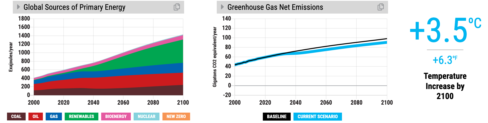
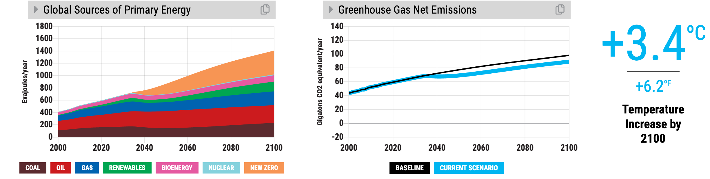
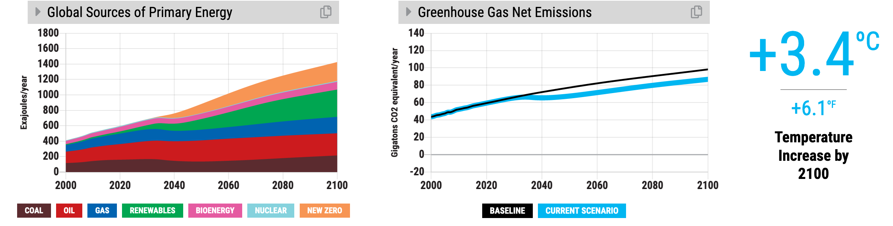
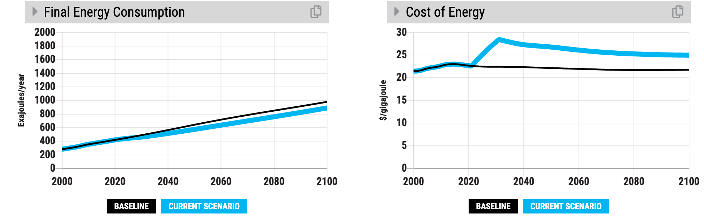
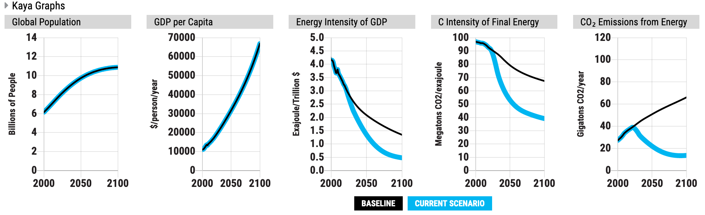

Background on En-ROADS Dynamics
===============================

Most of the dynamics in En-ROADS can be answered by these explanations:

Delays and capital stock turnover
---------------------------------

New energy sources (e.g., renewables and new technology) take decades (not years) to scale up to sufficiently compete with coal, oil, and gas. There are two main sources of these delays. New supply capacity doesn’t show up until old, long-lived capacity is retired (e.g., coal-fired power plants and oil refineries, which can survive for ~30 years). Only 6% of the total stock gets added every year. New zero-carbon energy may secure 20-50% of that market share, but even then, it adds only 1-3% to the total stock. The climate is only helped when coal, oil, and gas is retired away, and in the absence of other interventions, that amount is relatively small – approximately 3% per year.

.. image:: ../images/background_images/slowcapitalstockturnover.png
    :scale: 40
    :align: center

**This addresses questions such as:**

-  “Why doesn’t subsidizing renewables, nuclear or a new technology help avoid more warming?”

With the delays in increasing the energy efficiency of energy-using capital such as vehicles, buildings, and industry, the average lifetime is much shorter (10-15 years), but the effect is similar. One can promote increases to energy efficiency of new cars immediately, for example, but the average takes decades to increase.

|image20|

**To illustrate this point:** Move the New Technology slider to huge breakthrough. Examine the “Global Sources of Primary Energy” graph and notice that, even as low-carbon sources grow, it takes several decades before enough fossil fuel capacity retires away to make much of an impact. Notice, in the graph above, that coal, oil, and natural gas grow steadily through the 2020s and 2030s and greenhouse gas emissions do not depart from the Business as Usual line until mid-century.

**Implications of this dynamic:** Policies that merely promote alternatives to fossil fuels take several decades to reduce carbon dioxide emissions – the existing infrastructure takes a long time to retire away. Thus, meeting climate goals also requires direct disincentives to building and using fossil fuel infrastructure.

Price, demand, and supply are linked 
-------------------------------------

Energy demand falls if energy prices rise, and demand increases if prices fall. The first is evident when carbon prices increase. The second, when zero-carbon energy such as renewables or new technology are either subsidized or experience a breakthrough in cost improvement. This is often called the ‘rebound effect’ or the Jevons paradox.

While subsidizing low carbon energy supplies such as Renewables, watch Final Energy Consumption increase. Inexpensive wind and solar spreading around the world decreases overall energy prices and boosts energy demand up:

|image22|

While increasing carbon price, watch Final Energy Consumption decrease. If you want to see an intermediate variable, look at the "Cost of Energy" graph – costs increase so demand decreases:

|image23|

Success builds success
----------------------

Increasing the new capacity and installations of energy sources leads to a decrease in price, and therefore even greater capacity and installations. Costs of energy supplies such as renewables fall as cumulative experience is gained through the learning feedback loop, also known as "economies of scale." Every doubling of cumulative installed capacity of renewables reduces costs by around 20%, creating a reinforcing loop.

.. image:: ../images/background_images/learningloop.png
   :scale: 50
   :align: center

This reinforcing feedback loop explains the dynamic. As relative price of renewables falls, the relative attractiveness of renewables grows, there is a greater percentage of new capacity met by renewables, more installations of renewables, further learning, and prices fall even further. 

**This addresses questions such as:**

-  “Why should we have hope?”

-  “How can we afford a transition to a low carbon economy?”

-  “Aren’t the costs of renewables prohibitive?"

**To illustrate this point:** Look at the "Renewables Primary Energy Demand" graph in a scenario in which Renewables are subsidized. It sparks exponential growth that is driven and sustained by the reinforcing learning loop figure shown above.

|image25|

.. _section-1:

.. _section-2:

.. _section-3:

Fossil fuel growth has long term constraints
--------------------------------------------

Rising costs due to the scarcity of oil and gas materials put limits on the pace of growth of many energy supplies. This creates a balancing effect that is evident in the 2060s-2080s for oil and gas in the Business as Usual scenario when they begin to level off. Oil peaks and falls, while the growth rate of Natural Gas begins decreasing. 

**This addresses questions such as:**

-  “Why do the curves for gas and oil level out?”

**To illustrate this point:** See the "Global Sources of Primary Energy" graph post 2060 for oil and gas. Supplies of oil and gas are becoming scarce, pushing up their prices and curtailing investment in new capacity. Note – it isn’t accurate to say that the world is exactly “running out” of oil and gas. You may also notice that the effect is not present with coal because there are more abundant supplies of coal reserves in the world.

|image26|

Assumptions for available reserves of coal, oil, and gas are viewable and changeable in the “Assumptions” view.

Supplies compete for market share
---------------------------------

Many assume that if the world promoted several long term zero-carbon energy supplies such as nuclear, wind, solar, and some new technology, their contribution to carbon mitigation would be additive. Instead, in the simulator one can see that they compete. More of one, less of the other.

**This addresses questions such as:**

-  “Why didn’t it help to add nuclear to this renewable-dominant scenario?”

**To illustrate this point:** See the "Global Sources of Primary Energy" graph in the three scenarios below. In the first graph, we subsidize renewables alone; in the second, new technology is subsidized on its own; in the third graph, we subsidize both. 

In the following scenario, a renewables subsidy leads to a 0.3 degrees Celsius reduction in temperature: 

A huge breakthrough in New Technology also leads to the same 0.3 degree Celsius reduction on its own: 

When combined, instead of seeing an additive 0.6 degree Celsius reduction, we only see a 0.4 degree reduction in temperature due to the energy supplies competing with each other for market share: 

Population and GDP/capita growth drive emissions
------------------------------------------------

A challenge to limiting future warming in this simulation is the powerful growth in global GDP, which is population times the GDP/person. Energy efficiency and changes to the fuel mix can help reduce energy emissions, but their success is dampened by the overall ~2% per year growth in GDP. Recognizing this fact leads many game players to explore different futures for population (for example, by empowering women in developing countries, which could lower population growth) and GDP/capita (for example, by finding ways to meet economic needs without increasing consumption).

**This addresses questions such as:**

-  “We’ve done a lot in energy efficiency and clean energy – why haven’t emissions reduced substantially enough?”

**To illustrate this point:** See the Kaya Graphs view below for a low emissions scenario with increased energy efficiency and a transition to low carbon energy sources. Even though Energy Intensity of GDP improves and the C Intensity of Final Energy decreases as well, CO\ :sub:`2` Emissions from Energy doesn't see as dramatic a drop as expected due to the continued growth in Global Population and GDP per Capita.

|image28|

Non-CO\ :sub:`2` emissions affect temperature significantly 
------------------------------------------------------------

Methane, N\ :sub:`2`\ O and the F-gases are controlled by the Methane & Other slider. Adjusting this has a large impact on temperature. This implies changes in livestock management and consumption, waste management, fertilizer use, and industry to make a difference. These emissions make up around 26% of total greenhouse gas emissions. 

**Addresses questions such as:**

-  “We’ve done a lot in energy – why haven’t we solved the climate crisis?”

**To illustrate this point:** See the "Non-CO\ :sub:`2` Greenhouse Gas Emissions" graph and adjust the Methane & Other slider. See the scenario below – moderately reducing Methane & Other emissions achieves a large reduction in 2100 temperature.

|image29|

Temperature and CO\ :sub:`2` concentrations seem weakly responsive to CO\ :sub:`2` emissions 
---------------------------------------------------------------------------------------------

Emissions must fall significantly just to change the growth in temperature and CO\ :sub:`2` concentrations slightly. This counterintuitive dynamic is an important feature of the carbon and climate system. A short explanation for this dynamic would include the fact that the momentum in the carbon cycle and the climate lead to long delays between emissions and temperature.

**Addresses questions such as:**

-  “Emissions are stabilized, so why is temperature or CO\ :sub:`2` concentration still going up?”

**To illustrate this point:** See the "CO\ :sub:`2` Emissions and Removals" and "CO\ :sub:`2` Concentration" graphs in a scenario where CO\ :sub:`2` emissions stabilize. Even though CO\ :sub:`2` emissions (in red below) have flattened, CO\ :sub:`2` concentrations (in blue on the right below) continue to increase.

|image30|

Similarly, in a much more stringent scenario where CO\ :sub:`2` concentration stabilizes, temperature change continues to increase.

|image31|

To understand more about stocks, flows, and the bathtub framing below, watch `our video <https://www.youtube.com/watch?v=nRlYGDBGcRA>`_ as part of our `Climate Leader <https://staging.climateinteractive.org/programs/the-climate-leader/>`_ learning series. 

Please visit `support.climateinteractive.org <https://support.climateinteractive.org>`_ for additional inquires and support.

.. SUBSTITUTIONS SECTION

.. |image0| image:: ../images/media/image2.png
   :width: 0.60671in
   :height: 0.45277in
.. |image1| image:: ../images/media/image4.png
   :width: 0.52622in
   :height: 0.48612in
.. |image2| image:: ../images/media/image6.png
   :width: 0.59639in
   :height: 0.49444in
.. |image3| image:: ../images/media/image8.png
   :width: 0.49819in
   :height: 0.48945in

.. |image5| image:: ../images/media/image12.png
   :width: 0.46111in
   :height: 0.49339in

.. |image7| image:: ../images/media/image16.png
   :width: 0.49604in
   :height: 0.49604in
.. |image8| image:: ../images/media/image18.png
   :width: 0.55694in
   :height: 0.49064in
.. |image9| image:: ../images/media/image20.png
   :width: 0.55569in
   :height: 0.45763in
.. |image10| image:: ../images/media/image22.png
   :width: 0.54511in
   :height: 0.50115in

.. |image12| image:: ../images/media/image26.png
   :width: 0.61475in
   :height: 0.47903in
.. |image13| image:: ../images/media/image28.png
   :width: 0.56702in
   :height: 0.49385in
.. |image14| image:: ../images/media/image30.png
   :width: 0.92623in
   :height: 0.43265in
.. |image15| image:: ../images/media/image32.png
   :width: 0.78131in
   :height: 0.49772in
.. |image16| image:: ../images/media/image34.png
   :width: 0.63286in
   :height: 0.50101in

.. |image18| image:: ../images/media/image38.jpg
   :scale: 40

.. |image20| image:: ../images/media/image40.png
   :scale: 30

.. |image22| image:: ../images/media/image43.png
   :scale: 30

.. |image25| image:: ../images/media/image49.png
   :scale: 30

.. |image29| image:: ../images/media/image59.png
   :scale: 30
.. |image30| image:: ../images/media/image60.png
   :scale: 30
.. |image31| image:: ../images/media/image61.png
   :scale: 30

.. |image33| image:: ../images/media/image2.png
   :width: 0.60671in
   :height: 0.45277in
.. |image34| image:: ../images/media/image4.png
   :width: 0.52622in
   :height: 0.48612in
.. |image35| image:: ../images/media/image6.png
   :width: 0.59639in
   :height: 0.49444in
.. |image36| image:: ../images/media/image8.png
   :width: 0.49819in
   :height: 0.48945in

.. |image38| image:: ../images/media/image12.png
   :width: 0.46111in
   :height: 0.49339in

.. |image40| image:: ../images/media/image16.png
   :width: 0.49604in
   :height: 0.49604in
.. |image41| image:: ../images/media/image18.png
   :width: 0.55694in
   :height: 0.49064in
.. |image42| image:: ../images/media/image20.png
   :width: 0.55569in
   :height: 0.45763in
.. |image43| image:: ../images/media/image22.png
   :width: 0.54511in
   :height: 0.50115in

.. |image45| image:: ../images/media/image26.png
   :width: 0.61475in
   :height: 0.47903in
.. |image46| image:: ../images/media/image28.png
   :width: 0.56702in
   :height: 0.49385in
.. |image47| image:: ../images/media/image30.png
   :width: 0.92623in
   :height: 0.43265in
.. |image48| image:: ../images/media/image32.png
   :width: 0.78131in
   :height: 0.49772in
.. |image49| image:: ../images/media/image34.png
   :width: 0.63286in
   :height: 0.50101in

