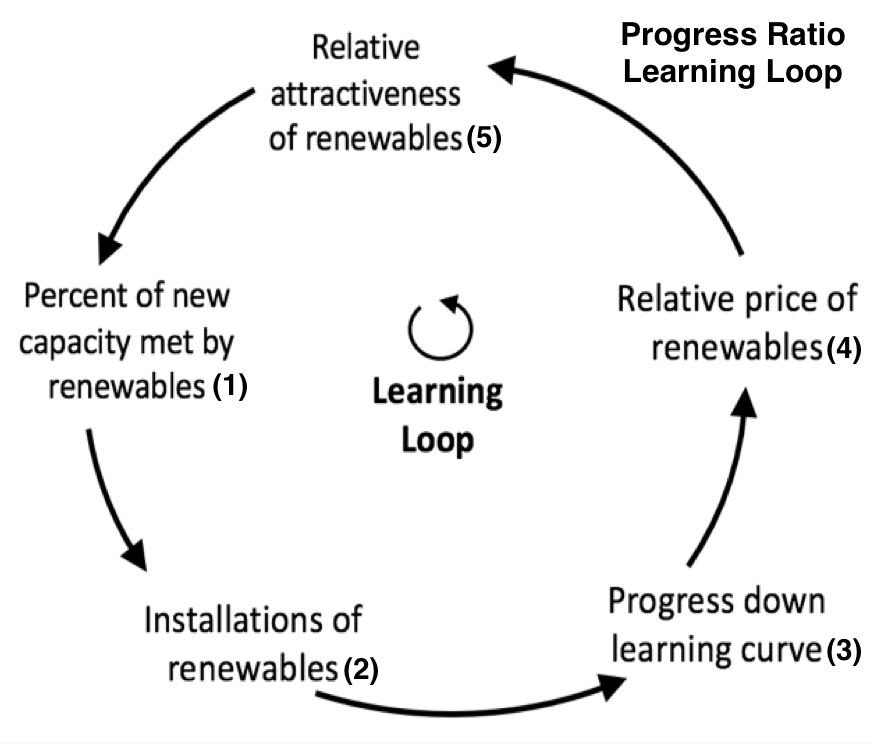
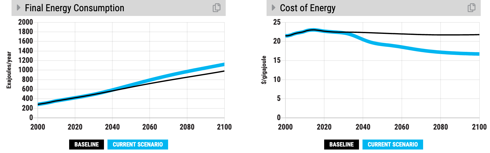

Background on En-ROADS Dynamics
===============================

A  simple way to think about the structure of En-ROADS is by considering the drivers of climate impacts. In the simulator, the concentration of greenhouse gases drives up global temperature, which leads to various impacts (e.g., sea level rise and ocean acidification). 

The concentration of greenhouse gases is driven by four main factors:

#.	**Energy CO2 emissions**, from burning coal, oil, gas, and biomass. This comprises  about 65% of greenhouse gas emissions.
#.	**Land use CO2 emissions**, from burning forests to create agricultural land.
#.	**CO2 removal**, which are approaches that pull carbon dioxide out of the atmosphere and store it in plants, soils, or underground leading to a decrease in CO2 concentrations.
#.	**Other greenhouse gas emissions** -- methane, N20, and f-gases. 

.. image:: ../images/background_images/causalstructure2.png

Going further, the Energy CO2 emissions are driven by four factors, which is known as the “Kaya Identity”. Population, consumption (GDP/capita),  energy intensity (energy use per dollar of GDP), and carbon intensity (CO2 emissions per unit of energy) are all multiplied together and the result is  overall energy CO2 emissions. In this way, at a high level, reducing CO2 emissions is about four things: fewer people, less consumption, more efficiency, and less high-carbon energy supplies.

.. image:: ../images/background_images/causalstructure3.png

Most of the dynamics in En-ROADS can be answered by these explanations:

Delays and capital stock turnover
---------------------------------

New energy technologies (e.g., renewables and new technology) take decades (not years) to scale up to sufficiently compete with coal, oil, and gas. There are two main sources of these delays:

New supply capacity doesn’t show up until old, long-lived capacity is retired (e.g., coal-fired power plants and oil refineries, which can survive for ~30 years). As the diagram to the right shows, only 6% of the total stock gets added every year. New zero-C energy may secure 20-50% of that market share, but even then, it adds only 1-3% to the total stock. The climate is only helped when coal, oil, and gas is retired away, and that amount is relatively small – approximately 3% per year.

Commercialization, permitting, financing, and construction all take time. Similarly, non-electrified end uses (e.g., cars and industry) can be electrified, but not instantaneously. Because of the time associated with building new energy infrastructure and retiring the old, the scale-up of energy technologies is much slower than the spread of many other technologies that we are familiar with, like smart phone apps or information technologies.

**Addresses questions such as:**

-  “Why doesn’t subsidizing renewables, nuclear or a new technology help avoid much warming?”

Note that a similar dynamic exists with the delays in increasing the energy efficiency of energy-using capital such as vehicles, buildings, and industry. The average lifetime is much shorter – 10-15 years – but the effect is similar: one can promote increases to energy efficiency of **new** cars immediately, for example, but the **average** takes decades to increase.

|image20|

**To illustrate this point:** Subsidize Renewables or New Technology. Examine the “Sources of Primary Energy” graph and notice that, even as low-carbon sources grow, it takes several decades before enough fossil fuel capacity retires away to make much of an impact. Notice, in the graph above, that in the new scenario, coal, oil, and gas grow steadily through the 2020s and 2030s and greenhouse gas emissions do not depart from the “business as usual” line until the 2040s.

**Implications of this dynamic:** Policies that merely promote alternatives to fossil fuels or increase energy efficiency take several decades to reduce carbon dioxide emissions – the existing infrastructure takes a long time to retire away. Thus, meeting climate goals also requires direct disincentives to fossil fuel infrastructure such as taxes.

Price, demand, and supply are linked 
-------------------------------------

Energy demand falls if energy prices rise, and demand increases if prices fall. The first is evident when carbon prices increase. The second, when zero-carbon energy such as renewables or New Tech are either subsidized or experience a breakthrough cost improvement. Often called the ‘rebound effect’ or the Jevons paradox.

**To illustrate this point:** See the ‘Final Energy Consumption’ graph in two scenarios:

|image22|

One, while subsidizing low carbon energy supplies such as Renewables, watch Final Energy Consumption increase. Inexpensive wind and solar spreading around the world decreases overall energy prices and boosts energy demand, pushing emissions up.

|image23|

And two, while increasing carbon price ($50 per ton, below), watch Final Energy Consumption decrease. If you want to see an intermediate variable, look at the ‘Cost of Energy’ graph – costs increase so demand decrease.

Success builds success
----------------------

Costs of energy supplies such as renewables fall as cumulative experience is gained through the “learning loop” and economies of scale. Every doubling of cumulative installed capacity of renewables reduces costs by around 20%, creating a reinforcing loop.

**Addresses questions such as:**

-  “Why should we have hope?”

-  “How can we afford a transition to a low carbon economy?”

-  “Aren’t the costs of renewables prohibitive?"

**To illustrate this point:** Look at the ‘Renewables Primary Energy Demand’ graph in a scenario in which Renewables are subsidized. It sparks exponential growth that is driven and sustained by the ‘Reinforcing Learning Loop’ figure shown above.

|image25|

.. _section-1:

.. _section-2:

.. _section-3:

Fossil fuel growth has long term constraints
--------------------------------------------

Rising costs due to scarcity of oil and gas materials put limits on the pace of growth of many energy supplies. This creates a balancing effect that is evident in the 2060s-2080s for oil and gas in the Business as Usual scenario when they begin to level off.

**Addresses questions such as:**

-  “Why do the curves for gas and oil level out?”

**To illustrate this point:** See the ‘Sources of Primary Energy’ graph post 2060 for oil and gas. Supplies of oil and gas are becoming scarce, pushing up their prices and curtailing investment in new capacity. Note – it isn’t accurate to say that the world is exactly “running out” of oil and gas. You may also notice that the effect, while present, is much weaker with coal. That’s because there are more abundant supplies of coal reserves in the world.

|image26|

Assumptions for available reserves of coal, oil, and gas are viewable and changeable in the “Assumptions” view.

Supplies compete for market share
---------------------------------

Many assume that if the world promoted several long term zero-carbon energy supplies such as nuclear, wind, solar, and some new technology, their contribution to carbon mitigation would be additive. Instead, in the simulator one can see that they compete. More of one, less of the other.

**Addresses questions such as:**

-  “Why didn’t it help to add nuclear to this renewable-dominant scenario?”

**To illustrate this point:** See the ‘Sources of Primary Energy’ graph with and without subsidies to renewables or new technology. In the first graph, we subsidize a new technology alone; in the second, renewables alone; in the third graph, we subsidize both and they split market share. But all three scenarios achieve the same temperature change. Thus, the supplies compete and don’t supplement each other.

|image27|

Population and GDP/capita growth drive emissions
------------------------------------------------

Perhaps the biggest challenge to limiting future warming in this simulation is the powerful growth in global GDP, which is population times the GDP/person. Energy efficiency and changes to the fuel mix can help reduce energy emissions, but their success is dampened by the overall ~2% per year growth in GDP. Recognizing this fact leads many game players to explore different futures for population (for example, by empowering women in developing countries, which could lower population growth) and GDP/capita (for example, by finding ways to meet economic needs without increasing consumption).

**Addresses questions such as:**

-  “We’ve done a lot in energy efficiency and clean energy – why haven’t we solved the climate crisis?”

**To illustrate this point:** See the ‘Kaya Graphs’ View. Even though Energy Intensity of GDP improves a lot (the blue line falls faster) and the C intensity of Primary Energy decreases as well, CO2 Emissions from Energy continues to grow until 2060 and then, only then, falls. The reasons are on the left side of the view – steadily growing Global Population and GDP per Capita.

|image28|

Non-CO\ :sub:`2` emissions affect temperature a lot 
----------------------------------------------------

Methane, N\ :sub:`2`\ O and the f-gases are controlled by the “Methane & Other Gases” slider in En-ROADS. Adjusting this has a large impact on temperature. This implies changes in livestock management and consumption, waste management, fertilizer use, and industry to make a difference.

**Addresses questions such as:**

-  “We’ve done a lot in energy – why haven’t we solved the climate crisis?”

**To illustrate this point:** See the ‘Non- CO\ :sub:`2` Greenhouse Gas Emissions’ graph and move the ‘Methane & Other’ slider. See the scenario below – moderately reducing Methane & Other emissions achieve a full 0.3°C reduction in 2100 temperature. That is a lot.

|image29|

Temperature and CO\ :sub:`2` concentrations seem weakly responsive to CO\ :sub:`2` emissions 
---------------------------------------------------------------------------------------------

Emissions must fall significantly just to change the growth in temperature and CO\ :sub:`2` concentrations slightly. This counterintuitive dynamic is an important feature of the carbon and climate system. A short explanation for this dynamic would include the fact that the momentum in the carbon cycle and the climate lead to long delays between emissions and temperature.

**Addresses questions such as:**

-  “Emissions are stabilized, so why is temperature or CO\ :sub:`2` concentration still going up?”

 **To illustrate this point:** See the ‘CO\ :sub:`2` Emissions and Removals’ graph in and explore the Bathtub dynamics, below. Even though CO2 emissions (in red below) have flattened, CO2 concentrations (in blue on the right below) continue to increase.

|image30|

And similarly, below, in a different (and much more stringent) scenario, even though CO2 concentration levels, temperature change increases.

|image31|

.. image:: ../images/background_images/bathtub.png
   :scale: 75
   :align: center

.. SUBSTITUTIONS SECTION

.. |image0| image:: ../images/media/image2.png
   :width: 0.60671in
   :height: 0.45277in
.. |image1| image:: ../images/media/image4.png
   :width: 0.52622in
   :height: 0.48612in
.. |image2| image:: ../images/media/image6.png
   :width: 0.59639in
   :height: 0.49444in
.. |image3| image:: ../images/media/image8.png
   :width: 0.49819in
   :height: 0.48945in
.. |image4| image:: ../images/media/image10.png
   :width: 0.52569in
   :height: 0.52152in

.. |image6| image:: ../images/media/image14.png
   :width: 0.35931in
   :height: 0.49106in
.. |image7| image:: ../images/media/image16.png
   :width: 0.49604in
   :height: 0.49604in
.. |image8| image:: ../images/media/image18.png
   :width: 0.55694in
   :height: 0.49064in
.. |image9| image:: ../images/media/image20.png
   :width: 0.55569in
   :height: 0.45763in
.. |image10| image:: ../images/media/image22.png
   :width: 0.54511in
   :height: 0.50115in
.. |image11| image:: ../images/media/image24.png
   :width: 0.43756in
   :height: 0.48429in
.. |image12| image:: ../images/media/image26.png
   :width: 0.61475in
   :height: 0.47903in
.. |image13| image:: ../images/media/image28.png
   :width: 0.56702in
   :height: 0.49385in
.. |image14| image:: ../images/media/image30.png
   :width: 0.92623in
   :height: 0.43265in
.. |image15| image:: ../images/media/image32.png
   :width: 0.78131in
   :height: 0.49772in
.. |image16| image:: ../images/media/image34.png
   :width: 0.63286in
   :height: 0.50101in
.. |image17| image:: ../images/media/image36.png
   :width: 0.71758in
   :height: 0.49177in

.. |image19| image:: ../images/media/image39.jpg
   :scale: 40
.. |image20| image:: ../images/media/image40.png
   :width: 6.5in
   :height: 2.31389in
.. |image21| image:: ../images/media/image42.jpg
   :scale: 75

.. |image23| image:: ../images/media/image45.png
   :width: 6.5in
   :height: 3.43472in
.. |image24| image:: ../images/media/image47.png
   :width: 2.91727in
   :height: 2.44307in
.. |image25| image:: ../images/media/image49.png
   :width: 4.34585in
   :height: 2.16549in
.. |image26| image:: ../images/media/image50.png
   :width: 4.01181in
   :height: 2.75139in
.. |image27| image:: ../images/media/image52.png
.. |image28| image:: ../images/media/image58.png
   :width: 7.32153in
   :height: 2.28681in

.. |image30| image:: ../images/media/image60.png
   :width: 6.5in
   :height: 2.15556in
.. |image31| image:: ../images/media/image61.png
   :width: 6.79635in
   :height: 2.29885in
.. |image32| image:: ../images/media/image62.jpg
   :width: 3.63125in
   :height: 2.72361in
.. |image33| image:: ../images/media/image2.png
   :width: 0.60671in
   :height: 0.45277in
.. |image34| image:: ../images/media/image4.png
   :width: 0.52622in
   :height: 0.48612in
.. |image35| image:: ../images/media/image6.png
   :width: 0.59639in
   :height: 0.49444in
.. |image36| image:: ../images/media/image8.png
   :width: 0.49819in
   :height: 0.48945in
.. |image37| image:: ../images/media/image10.png
   :width: 0.52569in
   :height: 0.52152in

.. |image39| image:: ../images/media/image14.png
   :width: 0.35931in
   :height: 0.49106in
.. |image40| image:: ../images/media/image16.png
   :width: 0.49604in
   :height: 0.49604in
.. |image41| image:: ../images/media/image18.png
   :width: 0.55694in
   :height: 0.49064in
.. |image42| image:: ../images/media/image20.png
   :width: 0.55569in
   :height: 0.45763in
.. |image43| image:: ../images/media/image22.png
   :width: 0.54511in
   :height: 0.50115in
.. |image44| image:: ../images/media/image24.png
   :width: 0.43756in
   :height: 0.48429in
.. |image45| image:: ../images/media/image26.png
   :width: 0.61475in
   :height: 0.47903in
.. |image46| image:: ../images/media/image28.png
   :width: 0.56702in
   :height: 0.49385in
.. |image47| image:: ../images/media/image30.png
   :width: 0.92623in
   :height: 0.43265in
.. |image48| image:: ../images/media/image32.png
   :width: 0.78131in
   :height: 0.49772in
.. |image49| image:: ../images/media/image34.png
   :width: 0.63286in
   :height: 0.50101in
.. |image50| image:: ../images/media/image36.png
   :width: 0.71758in
   :height: 0.49177in
