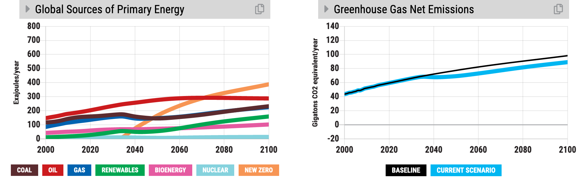
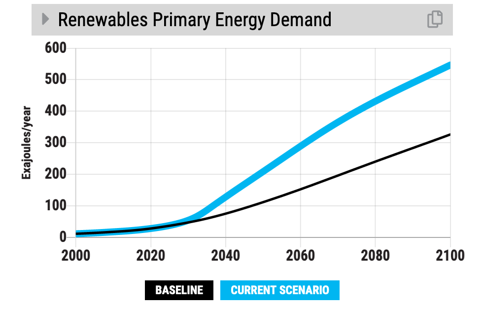
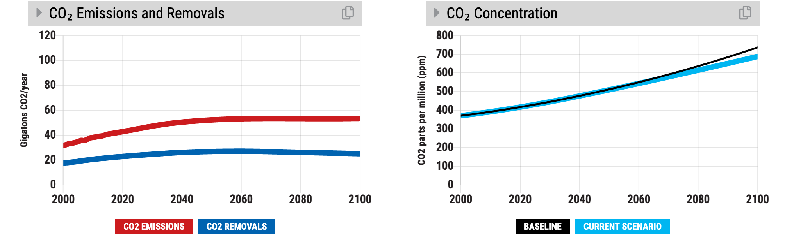
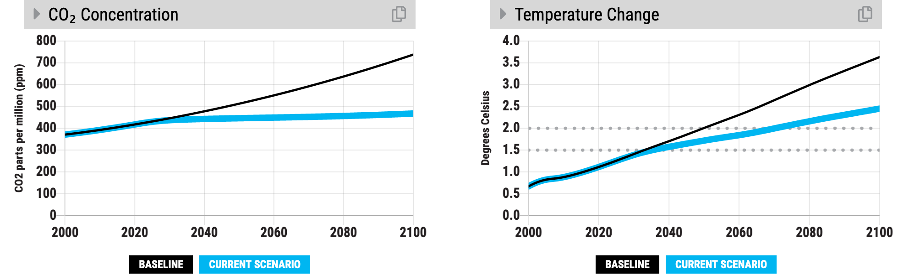

|image33| COAL
==============

**Discourage or encourage mining coal and burning it in power plants.** Coal is the most harmful fossil fuel in terms of carbon emissions, as well as in air pollutants that cause severe health impacts. It is a dominant source of energy globally, however, because it is relatively cheap to mine and transport.

Examples
--------

-  Government policies that **phase out** power plants or make them more expensive in any way, such as taxes on coal.

-  Financial services industry (e.g. banks) or global development institutions (e.g. World Bank) limiting access to **capital** for new coal mining, refining, and power plant infrastructure.

Slider Settings
---------------

================================================ ================= ============ ============ ========== ==========
\                                                very highly taxed highly taxed taxed        status quo subsidized
================================================ ================= ============ ============ ========== ==========
Change in price per ton of coal equivalent (tce) +$100 to +$60     +$60 to +$30 +$30 to +$10 **+$10 to  -$10 to
                                                                                             -$10**     -$30
Cost increase or decrease                        +%100 to +%60     +%60 to +%30 +%30 to +%10 **+%10 to  -%10 to
                                                                                             -%10**     -%30
================================================ ================= ============ ============ ========== ==========

Key Dynamics
------------

-  When coal is discouraged, by taxing it, watch the brown line go down in the “Sources of Primary Energy” graph. It is one of the most sensitive energy supplies to any increase in cost. Unlike oil, it is much more substitutable for natural gas and renewables.

-  Slowing the growth of coal near-term reduces overall CO\ :sub:`2` emissions relative to what it would have been otherwise and makes a big gain for the climate.

-  Taxing coal also reduces energy demand (see graphs “Final Energy Consumption” and “Cost of Energy”). When energy prices are higher people tend to use energy more efficiently and conserve energy. However, tax policies must be implemented with considerations for poor and working-class communities who can be harmfully impacted by high energy prices.

Big Messages
------------

-  Discouraging coal is a high leverage strategy for reducing future temperature change. It keeps coal in the ground, increases the cost of energy, and reduces energy demand.

-  Discouraging coal also improves public health and saves medical costs through improved air quality.

Model Structure
---------------

The cost of coal affects three significant decisions regarding energy infrastructure:

1) investment in new capacity (whether or not to build new processing and power plants);

2) use of capacity (whether to run existing plants);

3) retirement of capacity (whether to keep plants longer or shorter than the average of ~30 years).

.. |image0| image:: ../images/media/image2.png
   :width: 0.60671in
   :height: 0.45277in

.. |image2| image:: ../images/media/image6.png
   :width: 0.59639in
   :height: 0.49444in
.. |image3| image:: ../images/media/image8.png
   :width: 0.49819in
   :height: 0.48945in
.. |image4| image:: ../images/media/image10.png
   :width: 0.52569in
   :height: 0.52152in
.. |image5| image:: ../images/media/image12.png
   :width: 0.46111in
   :height: 0.49339in
.. |image6| image:: ../images/media/image14.png
   :width: 0.35931in
   :height: 0.49106in
.. |image7| image:: ../images/media/image16.png
   :width: 0.49604in
   :height: 0.49604in

.. |image9| image:: ../images/media/image20.png
   :width: 0.55569in
   :height: 0.45763in
.. |image10| image:: ../images/media/image22.png
   :width: 0.54511in
   :height: 0.50115in
.. |image11| image:: ../images/media/image24.png
   :width: 0.43756in
   :height: 0.48429in
.. |image12| image:: ../images/media/image26.png
   :width: 0.61475in
   :height: 0.47903in
.. |image13| image:: ../images/media/image28.png
   :width: 0.56702in
   :height: 0.49385in

.. |image16| image:: ../images/media/image34.png
   :width: 0.63286in
   :height: 0.50101in
.. |image17| image:: ../images/media/image36.png
   :width: 0.71758in
   :height: 0.49177in
.. |image18| image:: ../images/media/image38.jpg
   :width: 3.38889in
   :height: 2.54167in
.. |image19| image:: ../images/media/image39.jpg
   :width: 3.3125in
   :height: 1.55in

.. |image21| image:: ../images/media/image42.jpg
   :width: 4.31667in
   :height: 1.42222in
.. |image22| image:: ../images/media/image43.png
   :width: 6.5in
   :height: 2.32083in
.. |image23| image:: ../images/media/image45.png
   :width: 6.5in
   :height: 3.43472in
.. |image24| image:: ../images/media/image47.png
   :width: 2.91727in
   :height: 2.44307in

.. |image26| image:: ../images/media/image50.png
   :width: 4.01181in
   :height: 2.75139in
.. |image27| image:: ../images/media/image52.png
   :width: 7.03542in
   :height: 1.97639in
.. |image28| image:: ../images/media/image58.png
   :width: 7.32153in
   :height: 2.28681in
.. |image29| image:: ../images/media/image59.png
   :width: 3.68681in
   :height: 2.43611in

.. |image32| image:: ../images/media/image62.jpg
   :width: 3.63125in
   :height: 2.72361in
.. |image33| image:: ../images/media/image2.png
   :width: 0.60671in
   :height: 0.45277in

.. |image35| image:: ../images/media/image6.png
   :width: 0.59639in
   :height: 0.49444in
.. |image36| image:: ../images/media/image8.png
   :width: 0.49819in
   :height: 0.48945in
.. |image37| image:: ../images/media/image10.png
   :width: 0.52569in
   :height: 0.52152in
.. |image38| image:: ../images/media/image12.png
   :width: 0.46111in
   :height: 0.49339in
.. |image39| image:: ../images/media/image14.png
   :width: 0.35931in
   :height: 0.49106in
.. |image40| image:: ../images/media/image16.png
   :width: 0.49604in
   :height: 0.49604in

.. |image42| image:: ../images/media/image20.png
   :width: 0.55569in
   :height: 0.45763in
.. |image43| image:: ../images/media/image22.png
   :width: 0.54511in
   :height: 0.50115in
.. |image44| image:: ../images/media/image24.png
   :width: 0.43756in
   :height: 0.48429in
.. |image45| image:: ../images/media/image26.png
   :width: 0.61475in
   :height: 0.47903in
.. |image46| image:: ../images/media/image28.png
   :width: 0.56702in
   :height: 0.49385in

.. |image49| image:: ../images/media/image34.png
   :width: 0.63286in
   :height: 0.50101in
.. |image50| image:: ../images/media/image36.png
   :width: 0.71758in
   :height: 0.49177in
