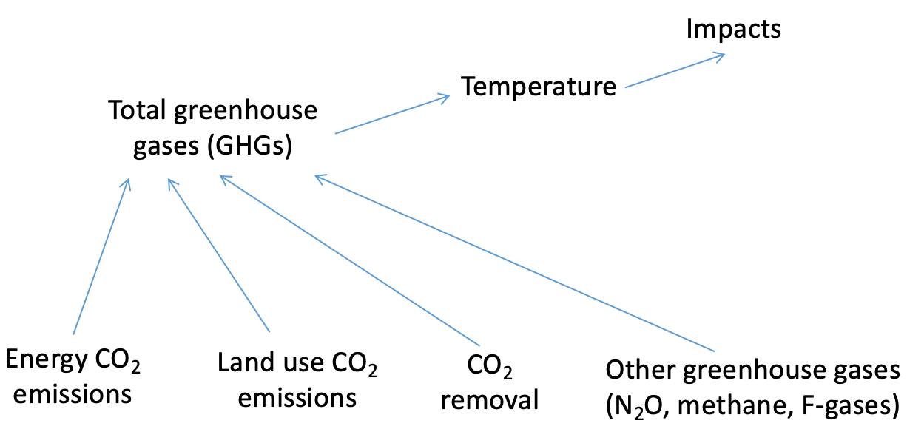

Background on En-ROADS Structure
=================================

A  simple way to think about the structure of En-ROADS is by considering the drivers of climate impacts. In the simulator, the concentration of greenhouse gases drives up global temperature, which leads to various impacts (e.g., sea level rise and ocean acidification). 

.. image:: ../images/background_images/causalstructure1.png

The concentration of greenhouse gases in the atmosphere is driven by four main sources:

#.	**Energy CO2 emissions** from burning coal, oil, gas, and biomass. CO\ :sub:`2` emissions comprise 67.5% of greenhouse gas emissions.
#.	**Land use CO2 emissions** such as forestry and land use change.
#.	**Carbon Dioxide removal** approaches that pull carbon dioxide out of the atmosphere and store it in plants, soils, or underground leading to a decrease in CO\ :sub:`2` concentrations.
#.	**Other greenhouse gas emissions** such as methane, N20, and f-gases, which comprise about 26% of total greenhouse gas emissions. 

Going further, CO\ :sub:`2` emissions from energy are driven by four factors, which is known as the “Kaya Identity”. Population, consumption (GDP/capita),  energy intensity (energy use per dollar of GDP), and carbon intensity (CO\ :sub:`2` emissions per unit of energy) are all multiplied together and the result is  overall energy CO\ :sub:`2` emissions. In this way, at a high level, reducing CO\ :sub:`2` emissions is about four things: fewer people, less consumption, more efficiency, and less high-carbon energy supplies.

.. image:: ../images/background_images/causalstructure3.png