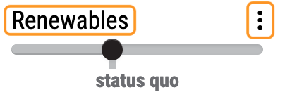
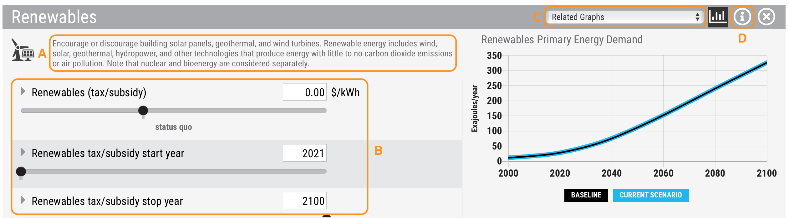

En-ROADS Tutorial
===============================

En-ROADS is designed to be easy to use. You can watch this 20-minute `introductory video tour <https://www.youtube.com/watch?v=7Muh-eoPd3g>`_ of En-ROADS. We encourage you to explore all the features of En-ROADS by clicking around. Here are some key features of En-ROADS:

Graphs
--------
There are almost 100 output graphs available in En-ROADS. They show data from different parts of the global energy and climate system, and update as you move sliders within En-ROADS. 

A. **Select graphs** – When you first open En-ROADS, you see the two default graphs. You can select from the full list of graphs by clicking the title of the left or right graph. You can also select from the Graphs menu from the top toolbar. 

B. **More info** – For more information about a graph and what it shows, select the triangle icon to the left of the graph title. 

C. **Copy graph data** – Copy the graph data to your clipboard using the copy icon on the top right side of a graph. 

D. **Shortcut to popular graphs** – You can quickly jump to a selection of the most commonly used graphs from the “Show miniature graphs” icon on the top toolbar. You can click any of these miniature graphs to switch to that graph in the main graph view.

E. **View larger graphs** – If you want to expand one of the graphs into a separate window, you can access our “Large Left Graph” or “Large Right Graph” feature from the View menu in the top toolbar.    

Sliders/Actions
-----------------

There are 18 sliders representing different actions you can test in the En-ROADS simulator. Click the title of the slider or the three dots on the right of each slider to access detailed slider settings: 

Here is what you will find in the detailed slider view:  

A. **A description of the overall slider** - This description provides further detail about the particular solution. 

B. **More control of the main slider** - You'll see the units associated with the slider and the numeric values of points along the slider. You can directly input numeric values to set the slider level to a specific value of your choice (within range). Scroll down to change and explore the related sliders. Click on the triangle to the left of each slider title to see a brief description of the slider. 

C. **Related graphs** - In the right panel, you'll see a graph relevant to the main slider as well as a choice of additional Related Graphs. These are useful to reference in order to examine the changes that occur from moving the sliders in this view. Select from the dropdown list of Related Graphs to view other graphs. You will still be able to see your slider moves impact the main graphs as well. 

D. **Help** - You can access more detailed information about the slider through the information button. This is the same information that is found for this topic in the En-ROADS User Guide. 

Top Toolbar Features
---------------------

Many useful features are just a click away from the top toolbar on En-ROADS. Here are some of the features that you can access. 

A. **Share Your Scenario** – You can share your unique scenario link to others. Others can open your En-ROADS scenario with all the settings you have chosen and the last main graphs you viewed. You can then share your scenario to social media channels. Grabbing the link from your browser’s URL bar will also work, however, your last viewed graphs will not be captured. 

B. **Replay Last Change** – This is a fun feature to rapidly replay your last change several times. This feature assists you in examining how the different parts of the system responded to your action by giving you more time to look for changes across related graphs. You can also use the other controls to Undo or Redo your last action (located left of the “replay last change” control on the top toolbar).

C.	**Assumptions** [under the “Simulation” menu] – Access and change important assumptions driving the En-ROADS model.

D.	**U.S. Units** [under the “View” menu] – Change from metric to U.S. units. 

E. **Actions and Outcomes** [under the “View” menu] – This list summarizes the total actions and key climate outcomes from your scenario.

F.	**Related Examples** [under the “Help” menu] – This list shares common examples of topics and solutions related to each of the 18 sliders. This is helpful when you need to quickly pull up a list of examples which relate to each of the sliders.

Please visit `support.climateinteractive.org <https://support.climateinteractive.org>`_ for additional inquires and support.

