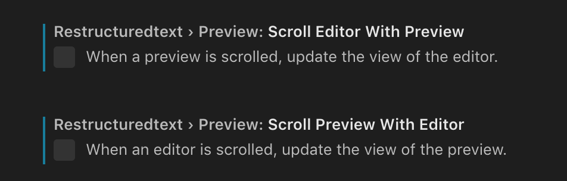
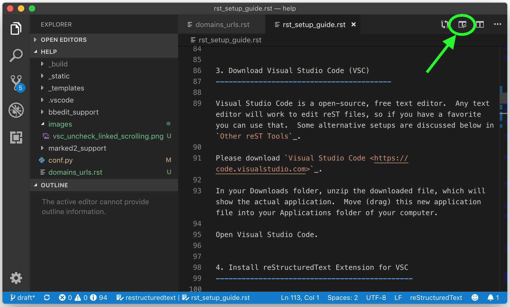

.. Testing area for RST related tests
   This is a comment that won't be seen.  Comments and the following lines need to be
   idented the same, without a blank line.

.. Below is a "title" section because it has '=' above and below it
   NOTE: you need a blank line between a comment and what follows

============================
RST Setup and Guide
============================

Setup
=======

ReadTheDocs (RTD) is a publishing platform that hosts our documentation for free. RTD uses a program called ``Sphinx`` to convert text files into webpages. 

The text files that you'll be writing will be *marked up* using a language called reStructuredText. reStructuredText is a markup language that uses plain text to denote styles, like headings, bold, italics, images, and URLs. Below, there are examples about the most common styles.

To get your computer setup, there are a few steps:

1. Use SourceTree to get the repo
2. Install Sphinx and RTD theme
3. Download Visual Studio Code (VSC)
4. Install the recommended reStructuredText Extension for VSC

1. Setting up SourceTree
-----------------------------

SourceTree is a application to help with version control of our files. SourceTree provides a (relatively) user-friendly interface to GitHub, the service that actually manages the files and keeps track of all the different versions.

Please download `SourceTree <https://www.sourcetreeapp.com>`_.

In your Downloads folder, unzip the downloaded file, which will show the actual application ``SourceTree.app``.  Move (drag) this new application file into your Applications folder of your computer.

Launch the ``SourceTree.app`` file from your Applications folder.  You'll be needing to connect it to your GitHub account, which is requires getting a special password. More info is `here <https://help.github.com/en/articles/creating-a-personal-access-token-for-the-command-line>`_.

2. Install Sphinx and RTD theme
-------------------------------------

You need to install two different packages via a command line. (A command line!?!?  You can do it!)

In your ``/Application/Utilities`` folder, open the application Terminal.  An easy way to open Terminal is to use Spotlight (Cmd-space) and type "terminal".

Let's check to see how your compute is currently set up:

In Terminal, at the prompt, type in:

``which python``

this will likely return a line that ``/usr/bin/python``.  If so, then type:

``python --version``

As of May 2019, this should return ``Python 2.7.10``.  Next, check to see if a command called ``pip`` is installed, by typing:

``which pip``

If it doesn't return anything (kinda looks like nothing happened), then ``pip`` isn't installed.  If it returns something like ``/usr/local/bin/pip``, then you're all set and can skip the next two commands, and to the command to install ``Sphinx``.

If ``pip`` isn't installed, please do the following commands.  **Note:** you'll be asked to enter in a password after the second command that starts with ``sudo``. Enter the password that you use to unlock and log into your computer.

::

  curl https://bootstrap.pypa.io/get-pip.py -o get-pip.py

  sudo python get-pip.py

Now ``pip`` is installed. With this tool installed, we can install the tool that we really need call ``sphinx``.
At the prompt copy and paste in the following:

``pip install --user sphinx``

and then

``pip install --user sphinx_rtd_theme``

Finally, make sure we can find the apps by issuing this command:

``echo "export PATH=$PATH:.:/Users/$USER/Library/Python/2.7/bin" >> .bash_profile``

You're done.  Nice work.

3. Download Visual Studio Code (VSC)
-----------------------------------------

Visual Studio Code is a open-source, free text editor.  Any text editor will work to edit reST files, so if you have a favorite you can use that.  Some alternative setups are discussed below in `Other reST Tools`_.

Please download `Visual Studio Code <https://code.visualstudio.com>`_.

In your Downloads folder, unzip the downloaded file, which will show the actual application.  Move (drag) this new application file into your Applications folder of your computer.

Open Visual Studio Code.

4. Install reStructuredText Extension for VSC
----------------------------------------------

In Visual Studio Code, go to the View menu and choose "Extensions".  In the search field type in `restructuredtext`.  Click the install button near the extension developed by "LeXtudio" (likely the first one, but double check).

Next, search for ``Code Spell Checker`` from Street Side Software.  Also click the ``Install`` button.

I found that turning off the preference to track scrolling to be a good idea. You can do this by going to gear icon of the reStructuredText extension, and then selecting ``Configure Extension Settings``. Turn off both ``Scroll Editor with Preview`` and ``Scroll Preview with Editor``, as shown in the screenshot.

Now go to :menuselection:`File-->Open` and choose the folder for the documentation -- the directory of the GitHub repository. This will create a `workspace` in Visual Studio Code that allows you to see all of the files in the repository. 

You should now be able to render (preview) the RST file by clicking the side-by-side preview button or the keyboard shortcut :kbd:`cmd-shift-R`.

   The side-by-side preview button is in the upper right corner for each tab.

Typical Workflow
====================

1. Open SourceTree and Pull
2. Open Visual Studio Code
3. Open the folder of the repository
4. Make edits
5. Save edits (which is required to update the VSC preview)
6. Review Preview in VSC to to make sure edits are correct
7. If corrections are needed, and go back to Step 4.
8. When done, go back to SourceTree.
9. Click Commit to save the changes as a single set of edits.  You'll need to include a useful commit message to explain what task was accomplished.
10. In SourceTree, click Push to upload the change to GitHub for the rest of the team to see.  This will also signal to ReadTheDocs to publish a new updated website, making them avaiable on the web.

Publishing with ReadTheDocs.org
===============================

Publishing to GitHub
=======================

reStructuredText Guide
==============================

Below is a guide to help write reStructuredText documents 

**Helper pages:**

I find this summary page the most helpful as they have written it for a general audience. They include a lot of nice examples for lists, images, tables, linking, etc.:
https://draft-edx-style-guide.readthedocs.io/en/latest/ExampleRSTFile.html

reST Basics guide from Sphinx:
http://www.sphinx-doc.org/en/master/usage/restructuredtext/basics.html

reST Cheatsheet:
https://thomas-cokelaer.info/tutorials/sphinx/rest_syntax.html

http://docutils.sourceforge.net/docs/user/rst/quickref.html

If you're interested in history and purpose of `reStructuredText <http://docutils.sourceforge.net/docs/ref/rst/introduction.html>`_. 

.. This is a 'heading' because it  has symbols below it; Not a "title" because it isn't above it.

Headings and Sections
========================================

ReStructuredText allows you to use different symbols to denote headings and sections. We should all use the same to be consistent. A common standard to follow is:

::

  Chapter 1 Equal Signs
  =====================
  
  Section 1.1 Dashes
  ------------------
  
  Subsection 1.1.1 Tildes
  ~~~~~~~~~~~~~~~~~~~~~~~
  
  Section 1.2 Dashes
  ------------------
  
  Chapter 2 Equal Signs Again
  ===========================

.. important:: The underline/overline must be at least as long as the title text. All headings marked with the same symbol are deemed to be at the same level (i.e., Heading 1, Heading 2, etc.).

Formatting Text
====================

Writing a paragraph is as simple as writing text.  You just need to leave a blank line after each paragraph.

Bold text is marked by two asteriks.  You make something bold like this: ``**Bold Text**``, which renders like this **Bold Text**.

Ordered and Unordered Lists
===================================

Use hash symbols (`#`) for ordered lists. When you use hash marks, the list will auto-number which makes ordering easy. You can use numbers also (e.g., `1.`), but then the numbering is manual.

::

	#. Here is the first item in the ordered list
	#. This item will automatically get the number 2
	#. One more for good luck

.. note:: Ordered lists usually use numerals. Nested ordered lists (ordered lists inside other ordered lists) use letters.

Use asterisks for unordered (bulleted) lists.

::

	* Who is teaching the course?
	* What university or college is the course affiliated with?
	* What topics and concepts are covered in your course?
	* Why should a learner enroll in your course?

For more good examples of lists and how to nest them, check out:

`Example RST File:Lists <https://draft-edx-style-guide.readthedocs.io/en/latest/ExampleRSTFile.html#ordered-and-unordered-lists>`_

Linking to Sites
=======================

There are different ways to include a URL. The easiest is probably:

::

  `Go to Climate Interactive <https://climateinteractive.org>`_

Which shows up as: `Go to Climate Interactive <https://climateinteractive.org>`_. This underlines "Go to Climate Interactive" (the text before the URL), and can be used in the middle of paragraphs, like this.

.. important:: There must be a space between the link text and the opening \< for the URL.

.. important:: The link text is surround by single quote marks and ends with an underscore.

Another way to make a link is to declare a the link text ("Climate Interactive" in the above example) and then definte the URL address later in the document. This could be useful if you want more readable text (the URL isn't mixed into the prose) and/or if you're reusing and URL several times.  You could, for instance, link to Climate Interactive any time it is mentioned using syntax like:

::

  There are a lot of great things about `Climate Interactive`_. 
  Any time `Climate Interactive`_ is mentioned we should make sure people can see the website.

  .. _Climate Interactive: http://climateinteractive.org/

which turns into 

There are a lot of great things about `Climate Interactive`_. 
Any time `Climate Interactive`_ is mentioned we should make sure people can see the website.\ [#footnoteTest]_

.. _Climate Interactive: http://climateinteractive.org/

Above, I use the Climate Interactive twice, but only define the URL address once below for both hyperlinks.

Different Ways to Display Math
==============================

math Role
------------------------

Role for inline math. Use like this:

Since Pythagoras, we know that :math:`a^2 + b^2 = c^2`.

math directive
~~~~~~~~~~~~~~~~~~~~~~~~~~~~

Directive for displayed math (math that takes the whole line for itself).

The directive supports multiple equations, which should be separated by a blank line:

.. math::

   (a + b)^2 = a^2 + 2ab + b^2

   (a - b)^2 = a^2 - 2ab + b^2

Lorem ipsum dolor sit amet, consetetur sadipscing elitr, sed diam nonumy eirmod tempor invidunt ut labore et dolore magna aliquyam erat, sed diam voluptua.

Images
======

This is the minimum for showing an image, an image ``directive`` with a path to a file:

::

  .. image:: images/smilely.png

Another way to show and image is to specify more layout information, like width and justification details. This would allow you to have the image positioned on left, center, or right side of the page with text wrapping around it, like:

.. image:: images/smilely.png
   :scale: 25
   :alt: the coolest dandelion blower ever
   :align: right

Lorem ipsum dolor sit amet, consetetur sadipscing elitr, sed diam nonumy eirmod tempor invidunt ut labore et dolore magna aliquyam erat, sed diam voluptua. At vero eos et accusam et justo duo dolores et ea rebum. Stet clita kasd gubergren, no sea takimata sanctus est Lorem ipsum dolor sit amet. Lorem ipsum dolor sit amet, consetetur sadipscing elitr, sed diam nonumy eirmod tempor invidunt ut labore et dolore magna aliquyam erat, sed diam voluptua. At vero eos et accusam et justo duo dolores et ea rebum. Stet clita kasd gubergren, no sea takimata sanctus est Lorem ipsum dolor sit amet. Lorem ipsum dolor sit amet.

Example code:

::

  .. image:: images/smilely.png
     :scale: 25
     :alt: the coolest smilely face ever
     :align: right

More info about images can be found here:
http://docutils.sourceforge.net/docs/ref/rst/directives.html#images

Substitutions
================

reST supports “substitutions” (ref), which are pieces of text and/or markup referred to in the text by `|name|`. They are defined like footnotes with explicit markup blocks, like this:

::

  .. |name| replace:: replacement *text*

or this:

::

  .. |caution| image:: warning.png
               :alt: Warning!

Table Demo
==========

**Grid table:**

+------------+------------+-----------+ 
| Header 1   | Header 2   | Header 3  | 
+============+============+===========+ 
| body row 1 | column 2   | column 3  | 
+------------+------------+-----------+ 
| body row 2 | Cells may span columns.| 
+------------+------------+-----------+ 
| body row 3 | Cells may  | - Cells   | 
+------------+ span rows. | - contain | 
| body row 4 |            | - blocks. | 
+------------+------------+-----------+

**Simple table:**

=====  =====  ====== 
   Inputs     Output 
------------  ------ 
  A      B    A or B 
=====  =====  ====== 
False  False  False 
True   False  True 
False  True   True 
True   True   True 
=====  =====  ======

List Demo
==========

Lorem ipsum dolor sit amet, consetetur sadipscing elitr, sed diam nonumy eirmod tempor invidunt ut labore et dolore magna aliquyam erat, sed diam voluptua.

* Here is a list.  It is important to have listed items. I don't know why it is bold and the bullet below isn't.
	1. we know this is importance because it has the number 1.
* another bulleted item

Definitions Demo
==================

The formatting for Definitions is the word/phrase and the an indention on the immediately following line.

what
  Definition lists associate a term with 
  a definition. 

how to do it
  The term is a one-line phrase, and the 
  definition is one or more paragraphs or 
  body elements, indented relative to the 
  term. Blank lines are not allowed 
  between term and definition.

Footnotes
===============

To do a footnote, you need to have a footnote marker like this ``[#someTag]_``. That is a square bracket, a hash, a descriptive tag, and then a closing square bracket and a underscore.\ [#fnDescription]_

Then you need to have the actual footnote later in the document after a ``rubric``, like this:[#anotherUsefulTag]_

::
  
  .. rubric:: Footnotes

  .. [#fnDescription] Text of the first footnote.
  .. [#anotherUsefulTag] A second footnote that is super handy to have.

.. rubric:: Footnotes

.. [#footnoteTest] This is a test from earlier in the document.
.. [#fnDescription] Text of the first footnote.
.. [#anotherUsefulTag] A second footnote that is super handy to have.

Embedding Content (YouTube, Vimeo, etc)
===========================================

There are several different solutions for embedding video content from YouTube. To make it easier for the CI Team to understand and maintain documentation, we've chosen to use a general solution for including all types of HTML code (instead of some specific solution for just YouTube. This general solution, using the ``.. raw:: html`` directive, can be used for embedding content from many difference websites.

Overall, the code is this:

::

  .. raw:: html

      

        <iframe width="560" height="315" src="https://www.youtube.com/embed/DqEsDT86Fls" frameborder="0" allow="accelerometer; autoplay; encrypted-media; gyroscope; picture-in-picture" allowfullscreen></iframe>
      

which would result in an embedded video, inline, like this:

.. raw:: html

    

      <iframe width="560" height="315" src="https://www.youtube.com/embed/DqEsDT86Fls" frameborder="0" allow="accelerometer; autoplay; encrypted-media; gyroscope; picture-in-picture" allowfullscreen></iframe>
    

To embed a YouTube video:

#. Go to the YouTube page of the video
#. Click the Share button below the video
#. Click the ``Embed`` option (which is currently next to Facebook, Twitter, etc.  Note this isn't simply copying the direct URL.)
#. Replace the ``<iframe>`` line in the above example with the new iframe text.

To embed content from other websites, it should be a similar process to the above -- replace the iframe code with the appropriate code from other sites.

For reference, another example of embedding content using the ``.. raw:: html`` directive `can be found here <https://docs.anaconda.com/restructuredtext/detailed/#youtube-videos-and-other-raw-html-in-rst-files>`_\ . This doesn't use the ``
`` wrapper, and also seems to work.

Other reST Tools
======================

Online editor with preview
--------------------------------

Below is an online tool that will render reStructuredText in a browser. The browser window contains a split view to the rst code is on left side with a preview on the right.   http://rst.ninjs.org

reStructuredText Preview independent of a text editor
----------------------------------------------------------

There are lots of good text editors out there. Visual Studio Code is nice, but some people may prefer other editors. Some of these other editors may not have the Extension support that VSC has, which allows it to render rst page as HTML.

`Marked 2 <https://itunes.apple.com/us/app/marked-2/id890031187?mt=12>`_ is a standalone application that can preview reStructuredText (and Markdown) while another app is editing the file. It can be used with any text editor. 

If you're doing lots of reST editing, this might be a good app to have installed, whether or not you're using VSC or another editor.

.. todo:: Document the Marked 2 setup procedure better.  How to get it working with rst2html.py as the processor.

.. code-block:: bash

    #!/bin/bash

    # Could $HOME be used here?
    RST2HTML="/Users/travler/Library/Python/2.7/bin/rst2html.py"

    # echo $MARKED_EXT  # for debugging
    if [ $MARKED_EXT = "rst" ]; then
      $RST2HTML /dev/stdin
    else
      echo "NOCUSTOM"
    fi

Lorem ipsum dolor sit amet, consetetur sadipscing elitr, sed diam nonumy eirmod tempor invidunt ut labore et dolore magna aliquyam erat, sed diam voluptua. At vero eos et accusam et justo duo dolores et ea rebum. Stet clita kasd gubergren, no sea takimata sanctus est Lorem ipsum dolor sit amet. Lorem ipsum dolor sit amet, consetetur sadipscing elitr, sed diam nonumy eirmod tempor invidunt ut labore et dolore magna aliquyam erat, sed diam voluptua.

